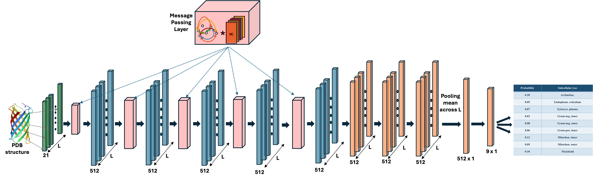

# GPSforTMDs: Membrane Protein Localization Prediction

[](https://opensource.org/licenses/Apache-2.0)
[](https://www.python.org/downloads/release/python-3100/)
[](https://pytorch.org/)
[](https://github.com/DeepGraphLearning/torchdrug)

Predicting membrane protein localization using graph neural networks on protein structure and chemistry.

**Link to project:** https://github.com/bivekpok/gearnet_nodupes



## How It's Made:

**Tech used:** Python, PyTorch, TorchDrug, Graph Neural Networks, CUDA, BioPython, Foldseek

This project implements a modified GEARNET architecture built on the TorchDrug framework for classifying membrane proteins into their native environments. The model processes protein structures as graphs where nodes represent α-carbons and edges capture spatial, sequential, and chemical relationships. We trained on a curated dataset from the OPM database, achieving competitive performance through rigorous structural de-duplication, careful handling of class imbalance, and an optimized 6-fold nested cross-validation strategy to prevent data leakage.

## 🧬 Data Preprocessing & Splitting Pipeline

To ensure the model is evaluated rigorously, our dataset pipeline is split into two distinct phases:

### Phase 1: Structural Redundancy Removal (Foldseek)
Standard sequence-based clustering is often insufficient for structural biology tasks. We use **Foldseek** to run strict 3D structural clustering (Sequence Identity $\ge$ 0.3, TM-score $\ge$ 0.3, Coverage $\ge$ 0.8). If a Representative protein and a Member protein fall into the same structural cluster *and* share the same membrane location, the redundant Member is discarded. This forces the model to learn generalizable features rather than memorized structural templates.

### Phase 2: Hybrid Nested Cross-Validation Splitting
We use a custom data splitting strategy to dedicate specific data for hyperparameter tuning while maintaining independent test sets:
* **The Outer Loop (Model Evaluation):** The full dataset is split into **6 independent Outer Folds** (holding out ~16% for testing per fold) using Stratified K-Fold to maintain class balance.
* **The Inner Loop (Training & Tuning):** * **Outer Fold 1:** Generates 3 distinct inner folds (holding out 8% for validation) specifically for Hyperparameter Sweeping.
  * **Outer Folds 2-6:** Generates exactly 1 inner fold (holding out 8% for validation) for final production training.

## Optimizations

- **Structural Redundancy Filtering:** Integrated Foldseek to cluster and remove structurally duplicate PDBs, ensuring robust model evaluation.
- **Hybrid 6-Fold Nested Cross-Validation:** Replaced standard 5-fold CV with a nested approach to isolate hyperparameter tuning from final testing.
- Added early stopping with 55-epoch patience to prevent overfitting.
- Used weighted loss functions proportional to class frequencies to combat severe class imbalance.
- Optimized graph construction with 7 edge types for rich structural representation.
- Achieved ~60% overall accuracy with F1 scores up to 0.65 for distinct membrane classes.
- Developed confidence-based filtering to identify low-quality predictions.

## Installation

### Prerequisites
- Conda (Miniconda or Anaconda)
- NVIDIA GPU with CUDA 12.1 (recommended)
- Foldseek (for data preprocessing)

### Quick Installation
```bash
git clone [https://github.com/bivekpok/gearnet_nodupes](https://github.com/bivekpok/gearnet_nodupes)
cd gearnet_nodupes
conda env create -f environment.yml  # Creates 'gearnet' environment
conda activate gearnet


## ⚡️ Usage

| Argument        | Description                               | Default   |
|-----------------|-------------------------------------------|-----------|
| `--pdb_folder`  | Path to membrane protein PDB files        | Required  |
| `--soluble_folder` | Path to soluble protein PDB files      | Required  |
| `--csv_path`    | Path to metadata CSV with localization labels | Required |
| `--output_dir`  | Directory to save training results        | Required  |
| `--num_epochs`  | Number of training epochs                 | 2500      |
| `--batch_size`  | Training batch size                       | 32        |
| `--learning_rate` | Initial learning rate                   | 1e-4      |
| `--gpus`        | GPU IDs to use (comma-separated)          | 0         |


python script.py \
    --pdb_folder <path_to_membrane_proteins> \
    --soluble_folder <path_to_soluble_proteins> \
    --csv_path <path_to_metadata_csv> \
    --output_dir <path_for_results> \
    [--num_epochs 2500]


### 📚 Citation

If you use this codebase in your research, please cite the following papers:

```bibtex
@inproceedings{zhang2022protein,
  title={Protein representation learning by geometric structure pretraining},
  author={Zhang, Zuobai and Xu, Minghao and Jamasb, Arian and Chenthamarakshan, Vijil and Lozano, Aurelie and Das, Payel and Tang, Jian},
  booktitle={International Conference on Learning Representations},
  year={2023}
}
bibtex
@article{zhang2023enhancing,
  title={A Systematic Study of Joint Representation Learning on Protein Sequences and Structures},
  author={Zhang, Zuobai and Wang, Chuanrui and Xu, Minghao and Chenthamarakshan, Vijil and Lozano, Aurelie and Das, Payel and Tang, Jian},
  journal={arXiv preprint arXiv:2303.06275},
  year={2023}
}

Also cite the original TorchDrug paper:

bibtex
@article{zhu2022torchdrug,
  title={TorchDrug: A powerful and flexible machine learning platform for drug discovery},
  author={Zhu, Zhaocheng and Shi, Chence and Zhang, Peifa and Liu, Shengchao and Xu, Mai and Yuan, Xinyu and Wang, Jiacheng and Zhang, Biao and Liu, Jie and Luo, Ying and others},
  journal={Journal of Machine Learning Research},
  volume={23},
  number={1},
  pages={1--8},
  year={2022}
}
bibtex
@article{pokhrel2024gpsfortmds,
  title={GPSforTMDs: Predicting Membrane Protein Localization by Deep Learning on Structure and Chemistry},
  author={Pokhrel, Bivek and Munley, Christian and Lyman, Edward and Pedraza, Miguel},
  journal={Nature Communications},
  year={2024},
  publisher={Nature Publishing Group}
}

